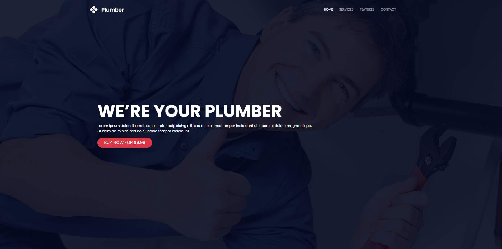

# Bootstrap_Plumber

## Dome 
[Go to Demo]()

## Description
**Plumber** A responsive and modern website template for plumbing services built using Bootstrap. This template is designed to showcase your plumbing business, services, and contact information in a clean and professional manner.

### Features
- **Responsive Design**: Optimized for all screen sizes, from desktops to mobile devices.
- **Bootstrap Framework**: Utilizes Bootstrap for easy customization and consistent design.
- **Custom Navigation**: A sticky navbar that changes background color on scroll.
- **Service Sections**: Dedicated sections for services, features, and customer testimonials.
- **Interactive Elements**: Animated counters and smooth scrolling for a dynamic user experience.
- **Google Maps Integration**: Embedded Google Maps to showcase your business location.
- **Font Awesome Icons**: Enhanced with Font Awesome icons for visual appeal.

### Technologies Used
- HTML5
- CSS3
- Bootstrap 5
- JavaScript (Vanilla)

## Project ScreenShot
